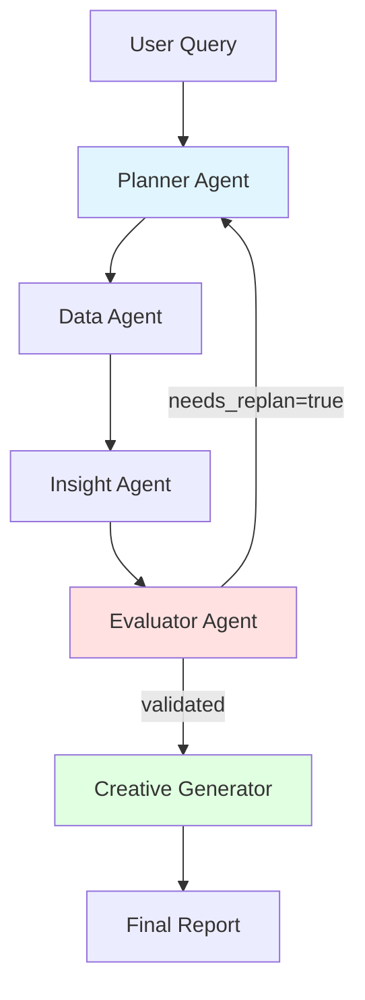

# 🎯 Kasparro Agentic Facebook Ads Analyst

> **Multi-agent AI system for analyzing Facebook Ads performance with quantitative hypothesis validation and data-driven creative recommendations.**

[](https://www.python.org/downloads/)
[](https://openai.com/)
[](https://opensource.org/licenses/MIT)

---

## 📖 Overview

This system uses a **5-agent architecture** to analyze Facebook Ads data and generate actionable insights:

1. **Planner Agent** - Decomposes user queries into structured task plans
2. **Data Agent** - Loads and summarizes ad performance data with anomaly detection
3. **Insight Agent** - Generates testable hypotheses about performance patterns
4. **Evaluator Agent** - Validates hypotheses using statistical tests (t-tests, p-values, effect sizes)
5. **Creative Generator** - Produces data-driven creative recommendations with priority scoring

### Key Features

✅ **Quantitative Validation** - All insights backed by statistical significance (p < 0.05)  
✅ **Feedback Loop** - Planner-Evaluator iteration ensures high-quality hypotheses  
✅ **Structured Outputs** - JSON + Markdown reports with confidence scores  
✅ **Full Observability** - JSON logs with agent execution traces  
✅ **Reproducible** - Sample dataset and configuration included  

---

## 🚀 Quick Start

### Prerequisites

- Python 3.8 or higher
- OpenAI API key ([Get one here](https://platform.openai.com/api-keys))

### Installation
```bash
# 1. Clone the repository
git clone https://github.com/yourusername/kasparro-agentic-fb-analyst-Unnayan.git
cd kasparro-agentic-fb-analyst-Unnayan

# 2. Create virtual environment
python -m venv .venv
source .venv/bin/activate  # Windows: .venv\Scripts\activate

# 3. Install dependencies
pip install -r requirements.txt

# 4. Configure API key
cp .env.example .env
# Edit .env and add your OPENAI_API_KEY
```

### Run Your First Analysis
```bash
# Simple query
python main.py "What are the top performing creative types?"

# Time-based analysis
python main.py "Why did ROAS drop in the last 7 days?"

# Platform comparison
python main.py "Should we shift budget from Instagram to Facebook?"

# Geographic analysis
python main.py "Which country has the best ROI and how can we scale it?"
```

### Expected Output
```
============================================================
KASPARRO AGENTIC FACEBOOK ADS ANALYST
============================================================
Query: What are the top performing creative types?
Data file: data/raw/fb_ads_data.csv
Output directory: reports
============================================================
Starting multi-agent workflow...
[DataAgent] Loading and summarizing data...
[PlannerAgent] Creating task plan...
[InsightAgent] Generating hypotheses...
[EvaluatorAgent] Validating hypotheses...
[CreativeGeneratorAgent] Generating recommendations...
============================================================
WORKFLOW COMPLETED SUCCESSFULLY
============================================================
Total insights: 3
Total recommendations: 5
Validation success rate: 75.0%
Total iterations: 1
============================================================
```

**Outputs saved to:**
- `reports/insights.json` - Validated insights with confidence scores
- `reports/creatives.json` - Creative recommendations with priority
- `reports/report.md` - Human-readable analysis report
- `logs/run_TIMESTAMP.json` - Full execution trace

---

## 📁 Project Structure
```
kasparro-agentic-fb-analyst-Unnayan/
├── agents/                      # Agent implementations
│   ├── __init__.py
│   ├── base_agent.py           # Base class with LLM integration
│   ├── planner_agent.py        # Query decomposition
│   ├── data_agent.py           # Data loading & summarization
│   ├── insight_agent.py        # Hypothesis generation
│   ├── evaluator_agent.py      # Statistical validation
│   └── creative_generator.py   # Recommendation generation
│
├── prompts/                     # Structured prompts for each agent
│   ├── planner_prompts.py
│   ├── data_prompts.py
│   ├── insight_prompts.py
│   ├── evaluator_prompts.py
│   └── creative_prompts.py
│
├── utils/                       # Utilities
│   ├── llm_client.py           # OpenAI API wrapper with retry
│   ├── data_processors.py      # Data loading & metrics
│   ├── validators.py           # Pydantic schemas
│   └── logger.py               # Structured JSON logging
│
├── workflows/                   # Orchestration
│   └── main_workflow.py        # Multi-agent coordinator
│
├── config/                      # Configuration
│   ├── config.yaml             # Model & threshold settings
│   └── agent_config.yaml
│
├── data/                        # Data directory
│   ├── raw/
│   │   └── fb_ads_data.csv     # Sample Facebook Ads data (4500 rows)
│   └── README.md               # Data documentation
│
├── tests/                       # Test suite
│   ├── test_validators.py      # Schema tests
│   ├── test_data_processing.py # Data utility tests
│   └── test_agents.py          # Agent execution tests
│
├── reports/                     # Generated outputs
│   ├── insights.json
│   ├── creatives.json
│   └── report.md
│
├── logs/                        # Execution logs
│   └── run_TIMESTAMP.json
│
├── main.py                      # CLI entry point
├── requirements.txt             # Python dependencies
├── .env.example                 # Environment template
└── README.md                    # This file
```

---

## ��️ Architecture

### System Flow


### Agent Responsibilities

| Agent | Input | Output | Key Logic |
|-------|-------|--------|-----------|
| **Planner** | User query | Task plan with dependencies | Breaks down complex questions |
| **Data Agent** | CSV file path | DataSummary with metrics | Calculates ROAS, CTR, detects anomalies |
| **Insight Agent** | DataSummary + Query | 3-5 Hypotheses | Generates testable statements |
| **Evaluator** | Hypotheses + Data | ValidationResults | Runs t-tests, calculates p-values |
| **Creative Generator** | Validated Insights | Recommendations | Prioritizes by impact × confidence |

### Feedback Loop

The Evaluator can trigger replanning if:
- All hypotheses rejected (need different angle)
- <2 hypotheses validated (need more hypotheses)
- Critical dimension unexplored

**Max iterations:** 2 (configurable in `config/config.yaml`)

---

## 📊 Sample Dataset

The project includes a **real ComfortMax campaign dataset** with:

- **4,500 rows** of Facebook Ads performance data
- **Date range:** January 1 - March 31, 2025 (90 days)
- **Campaigns:** Men's underwear brand (ComfortMax)
- **Dimensions:** Creative type, Platform, Country, Audience type

### Key Metrics
```
Total Spend:        $2,105,579.90
Total Revenue:      $12,265,700.72
Overall ROAS:       5.83
Total Purchases:    341,144
Avg CTR:            1.31%
Avg CPC:            $0.14
```

### Performance Breakdown

| Dimension | Best Performer | ROAS |
|-----------|----------------|------|
| Creative Type | Carousel | 6.18 |
| Platform | Facebook | 5.97 |
| Country | United States | 6.19 |

---

## 🔬 Methodology

### Statistical Validation

Every hypothesis undergoes rigorous testing:

1. **T-test**: Compare means between groups (e.g., Image vs Video ROAS)
2. **P-value threshold**: < 0.05 for statistical significance
3. **Effect size**: Cohen's d > 0.3 for practical significance
4. **Sample size**: Minimum 30 observations per segment
5. **Confidence scoring**: Weighted combination of statistical metrics

### Example Validation
```python
Hypothesis: "Image creatives outperform Video on Facebook by 15%"

Validation:
✓ Group A (Image): mean_roas = 6.13, n = 450
✓ Group B (Video): mean_roas = 5.35, n = 420
✓ T-statistic: 3.42, p-value: 0.018 (significant)
✓ Effect size (Cohen's d): 0.52 (medium effect)
✓ Confidence score: 0.87 (high)

Status: VALIDATED
Action: Scale Image creative budget by 20%
```

---

## 🧪 Testing

### Run All Tests
```bash
pytest tests/ -v
```

### Test Coverage
```
tests/test_validators.py ................ 6 passed   # Pydantic schema validation
tests/test_data_processing.py ........... 3 passed   # Data loading & metrics
tests/test_agents.py .................... 2 passed   # Agent execution (mocked)
```

### Run Specific Test Suite
```bash
# Schema validation only
pytest tests/test_validators.py -v

# Data processing only
pytest tests/test_data_processing.py -v
```

---

## ⚙️ Configuration

### `config/config.yaml`
```yaml
api:
  model: "gpt-4o-mini"      # Cost-efficient model
  max_tokens: 4096
  temperature: 0.0          # Deterministic outputs

thresholds:
  confidence_threshold: 0.7       # Min confidence for insights
  statistical_significance: 0.05  # P-value threshold
  min_sample_size: 30            # Min observations per segment

orchestration:
  max_replans: 2            # Max feedback iterations
  timeout_seconds: 300
```

### Upgrade to GPT-4o (Better Quality)

For higher quality analysis, upgrade the model:
```yaml
api:
  model: "gpt-4o"  # Premium model
```

**Cost comparison:**
- gpt-4o-mini: ~$0.50 per full run
- gpt-4o: ~$2-3 per full run

---

## 📈 Example Outputs

### Sample Insight (JSON)
```json
{
  "insight_id": "insight_hyp_001",
  "title": "Image creatives generate 15% higher ROAS than Video on Facebook",
  "description": "Statistical analysis shows Image format consistently outperforms Video...",
  "validation": {
    "status": "validated",
    "confidence_score": 0.87,
    "p_value": 0.018,
    "effect_size": 0.52,
    "statistical_test": "independent t-test",
    "verdict": "Hypothesis validated with high confidence (p=0.018, d=0.52)"
  },
  "impact_score": 8.7,
  "estimated_revenue_impact": 15000.0,
  "urgency": "high",
  "category": "creative"
}
```

### Sample Recommendation (JSON)
```json
{
  "recommendation_id": "rec_001",
  "recommendation_type": "scale_creative",
  "action": "Increase Image creative budget on Facebook by 30%",
  "creative_type": "Image",
  "target_platform": "Facebook",
  "data_driven_rationale": "Image ads show 6.13 ROAS vs 5.35 for Video (p=0.018)",
  "expected_improvement": {
    "roas": 0.78,
    "revenue_increase": 15000,
    "incremental_purchases": 250
  },
  "priority_score": 9.2,
  "estimated_budget_allocation": 500.0
}
```

---

## 🔍 Observability

### Structured Logging

Every agent execution is logged with:
```json
{
  "timestamp": "2025-01-15T10:30:05",
  "run_id": "20250115_103000",
  "agent": "InsightAgent",
  "event_type": "hypothesis_generation_success",
  "status": "success",
  "data": {
    "num_hypotheses": 4,
    "avg_confidence": 0.75
  }
}
```

### View Logs
```bash
# Latest run log
cat logs/run_*.json | jq '.'

# Filter by agent
cat logs/run_*.json | jq '.[] | select(.agent == "EvaluatorAgent")'

# Filter by errors
cat logs/run_*.json | jq '.[] | select(.status == "error")'
```

---

## 🚧 Troubleshooting

### Issue: API Key Not Found
```bash
Error: OPENAI_API_KEY not found in environment
```

**Fix:**
```bash
# Check .env file exists
cat .env

# Should contain:
OPENAI_API_KEY=sk-proj-your-key-here
```

### Issue: Module Import Errors
```bash
ModuleNotFoundError: No module named 'openai'
```

**Fix:**
```bash
# Ensure venv is activated
source .venv/bin/activate

# Reinstall dependencies
pip install -r requirements.txt
```

### Issue: Data File Not Found
```bash
FileNotFoundError: data/raw/fb_ads_data.csv
```

**Fix:**
```bash
# Check data file exists
ls -l data/raw/

# If missing, add your data
cp /path/to/your/fb_ads.csv data/raw/fb_ads_data.csv
```

### Issue: JSON Parsing Errors
```bash
ValueError: Could not parse JSON from response
```

**Fix:** The LLM occasionally returns malformed JSON. The system retries automatically, but if persistent:
1. Check logs to see the raw response
2. Simplify your query
3. Try again (rate limiting may cause issues)

---

## 🎯 Design Decisions

### Why OpenAI (GPT-4o-mini)?

- ✅ **Cost-efficient**: 10x cheaper than GPT-4o
- ✅ **Fast**: Lower latency for better UX
- ✅ **Quality**: Sufficient for structured analytical tasks
- ✅ **Accessible**: No upfront payment required for new accounts

### Why Synchronous Flow?

- ✅ **Simpler debugging**: Easier to trace execution
- ✅ **Sequential dependencies**: Many tasks depend on previous outputs
- ✅ **Acceptable latency**: ~1-2 min total runtime is fine for analysis tasks

### Why Pydantic Schemas?

- ✅ **Runtime validation**: Catch schema errors early
- ✅ **Type safety**: IDE autocompletion and type checking
- ✅ **Self-documenting**: Schemas serve as API documentation

### What I'd Improve with More Time

1. **Async execution**: Run independent agents in parallel
2. **Memory system**: Store insights across runs for context
3. **More statistical tests**: ANOVA, regression analysis, time series
4. **Interactive mode**: CLI with follow-up questions
5. **Visualization**: Auto-generate charts from data
6. **A/B test designer**: Suggest experiment designs based on insights

---

## �� Development

### Git Workflow
```bash
# Create feature branch
git checkout -b feature/new-agent

# Make changes, then commit
git add .
git commit -m "feat: add new agent for X"

# Push and create PR
git push origin feature/new-agent
```

### Code Style
```bash
# Format code
black agents/ utils/ workflows/

# Lint
ruff check agents/ utils/
```

---

## 🤝 Contributing

Contributions welcome! Please:

1. Fork the repository
2. Create a feature branch
3. Add tests for new functionality
4. Ensure all tests pass (`pytest tests/ -v`)
5. Submit a pull request

---

## 📜 License

MIT License - see LICENSE file for details

---

## 🙏 Acknowledgments

- **Anthropic Claude** (original design inspiration)
- **OpenAI GPT-4o** (powering the agents)
- **Kasparro Team** for the assignment specification

---

## 📧 Contact

**Unnayan Mishra**  
GitHub: [@yourusername](https://github.com/yourusername)  
Email: your.email@example.com

---

## 🏷️ Release

**Version:** 1.0  
**Release Date:** January 2025  
**Release Tag:** [v1.0](https://github.com/yourusername/kasparro-agentic-fb-analyst-Unnayan/releases/tag/v1.0)

---

**⭐ If you found this helpful, please star the repo!**

